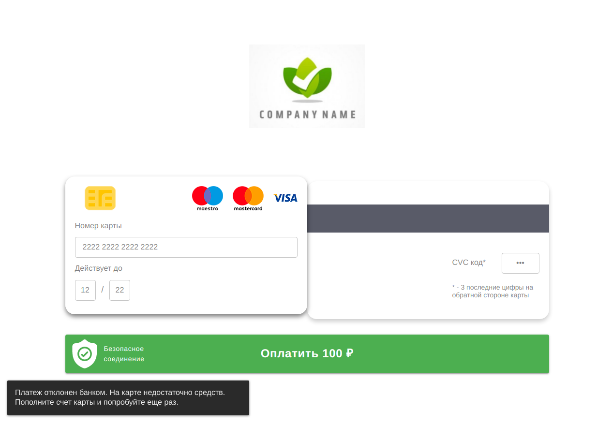

##### todo

  * в конструкторе `src/scripts/app.js` необходимо указать реальную платёжную ссылку и имплементировать обработку ответа 
  * чтобы заменить лого: меняем файл `src/assets/images/logo.png`, затем билдим `npm run build`
  
##### tech

  * билд собирается в директорию `build`
  * исходники в директории `src`
  * `npm run start` -- запуск dev-сервера с live reload
  * `npm run build` -- сборка билда из исходников
  * `yarn install` -- после клонирования репозитория перед началом работы (или `npm i`)  
